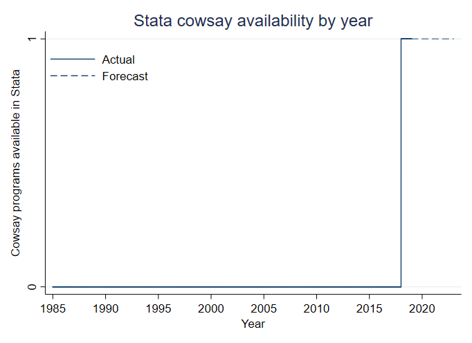

cowsay
=================================

[Overview](#overview)
| [Installation](#installation)
| [Usage](#usage)
| [Benchmarks](#benchmarks)
| [To-Do](#todo)
| [Acknowledgements](#acknowledgements)
| [License](#license)

Mooooo

`version 1.0 25jul2018`


Overview
---------------------------------

Much-needed [Cowsay](https://en.wikipedia.org/wiki/Cowsay) functionality for Stata.


Installation
---------------------------------

You have two options to get mooving with cowsay.

1. The most recent version can be installed from Github with the following Stata command:

```stata
net install cowsay, from(https://raw.githubusercontent.com/mdroste/stata-cowsay/master/)
```

2. A ZIP containing the program can be downloaded and manually placed on the user's adopath from Github.


Usage
---------------------------------

Consider the following example Stata output:

```
. sysuse auto
(1978 Automobile Data)

. reg price mpg

      Source |       SS           df       MS      Number of obs   =        74
-------------+----------------------------------   F(1, 72)        =     20.26
       Model |   139449474         1   139449474   Prob > F        =    0.0000
    Residual |   495615923        72  6883554.48   R-squared       =    0.2196
-------------+----------------------------------   Adj R-squared   =    0.2087
       Total |   635065396        73  8699525.97   Root MSE        =    2623.7

------------------------------------------------------------------------------
       price |      Coef.   Std. Err.      t    P>|t|     [95% Conf. Interval]
-------------+----------------------------------------------------------------
         mpg |  -238.8943   53.07669    -4.50   0.000    -344.7008   -133.0879
       _cons |   11253.06   1170.813     9.61   0.000     8919.088    13587.03
------------------------------------------------------------------------------

. cowsay "Mooo! The R2 is `e(r2)'"
 
   -----------------------------------
  < Mooo! The R2 is .2195828561874973 >
   -----------------------------------
         \   ^__^
          \  (oo)\_______
             (__)\       )\/\
                 ||----w |
                 ||     ||

```

For more documentation, consult the help file in Stata:
```stata
help cowsay
```


Benchmarks
---------------------------------

Cowsay is the first Stata program to implement cowsay functionality in 33 years. This point is illustrated below.


  

Todo
---------------------------------

The following items will be addressed before submitting to SSC, maybe:

- [ ] Word wrap


Acknowledgements
---------------------------------

Cowsay was written by Tony Monroe a really long time ago.

Mauricio Caceres Bravo ([@mcaceresb](https://github.com/mcaceresb)) made this a lot better.


License
---------------------------------

Cows have no concept of software licensing.

